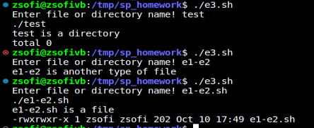

# Scientific programming – L1 MVs Report

I managed to set up the Virtual Machine and the Ubuntu on my system.

The configuration consists of **Ubuntu(64-bit) OS, Base Memory of 4096 MB, Video memory of 16MB and a Graphics controller of VMSVGA**.

# Exercises:

**The code for the exercises could be find above in separate files** for each exercise (except for the first 2, those are in the same file).

E1: Write a shell script that prints "hello world" on the screen

E2: Store the output of the command "uname" in a variable and "uname -m" in another.
Display This system is running an OS of name _ in __ architecture
where "_" is the output of the "uname" command and "__" is the output of "uname -m".

CODE : **e1-e2.sh** file

OUTPUT:

E3:  write a shell script that prompts the user for a name of a file or directory and
reports if it is a regular file, a directory, or another type of file. Also perform an
ls command against the file or directory with the long listing option.

CODE : **e3.sh** file

OUTPUT:

E4:  Modify the previous script to that it accepts the file or directory name as an argument instead of prompting the user to enter it.

CODE : **e4.sh** file

OUTPUT:

E5:  Write a shell script that consists of a function that displays the number of files in
the present working directory. Name this function filecounter and call it in
your script. If you use variable in your function, remember to make it a local
variable.

CODE : **e5.sh** file

OUTPUT:

